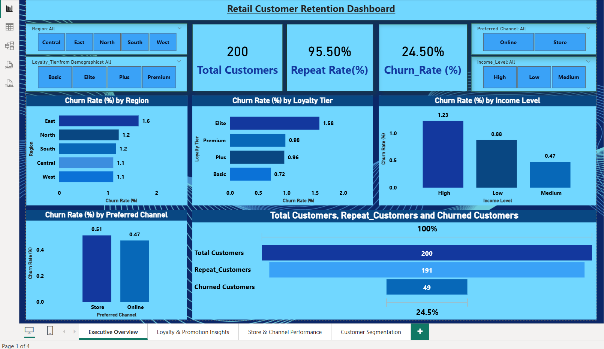
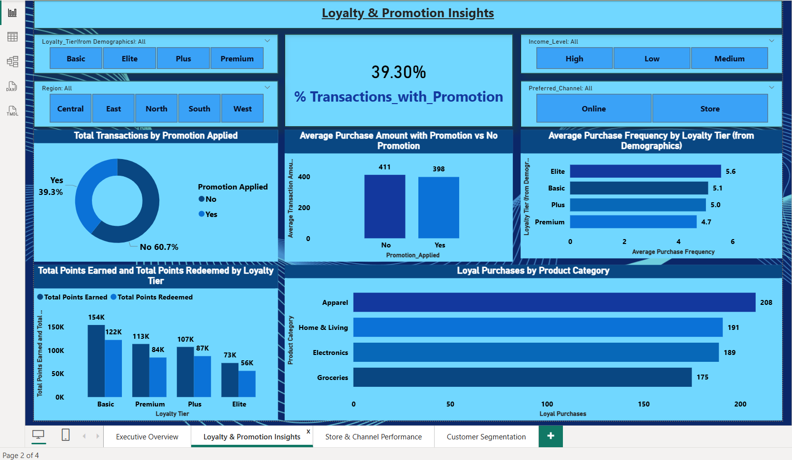
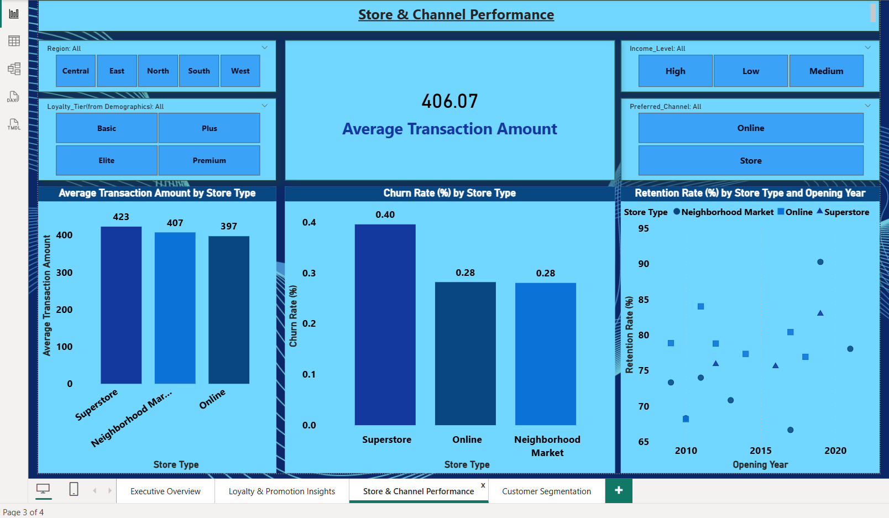
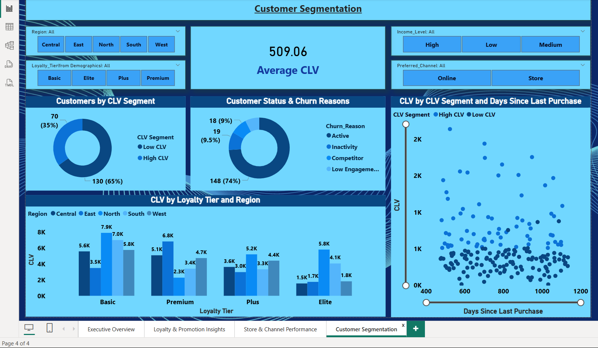

# 📊 Retail Customer Retention — Power BI Dashboard

---

## 📌 Project Overview

This project analyzes retail customer behavior to identify churn patterns, retention trends, loyalty impact, and Customer Lifetime Value (CLV) insights using **Power BI**.

The dashboard provides interactive visualizations to support data-driven business decisions focused on improving customer retention and operational performance.

---

## 📥 How to View

- Download the `.pbix` file and open using **Power BI Desktop**.  
- Interactive visuals and slicers are available across 4 dashboard pages.

---

## 🎯 Business Objectives

- Analyze overall customer retention and churn rate
- Identify high-risk churn segments
- Evaluate loyalty program performance
- Compare store and channel performance
- Segment customers based on CLV
- Provide actionable business insights

---

## 🛠 Tools & Technologies

- **Power BI**
- **Power Query (Data Transformation)**
- **DAX (Data Analysis Expressions)**
- **CSV Dataset**

---

## 📂 Dataset Information

The dataset consists of 5 CSV files:

- `Customer_Demographics.csv`
- `Customer_Transactions.csv`
- `Loyalty_Program.csv`
- `Store_Locations.csv`
- `Churn_Labelled_Customers.csv`

### Key Data Fields:
- Customer ID
- Region
- Income Level
- Loyalty Tier
- Transaction Amount
- Promotion Applied
- Store Type
- Last Purchase Date
- Churn Flag & Churn Reason

---

## 🧠 Data Modeling

- Star schema model
- Fact Table: Customer Transactions
- Dimension Tables:
  - Customer Demographics
  - Loyalty Program
  - Store Locations
  - Churn Information
- Relationships built using Customer_ID and Store_ID

---

## 📊 Dashboard Pages

### 1️⃣ Executive Overview

**KPIs Included:**
- Total Customers
- Repeat Rate (%)
- Churn Rate (%)

**Insights:**
- Churn rate segmented by Region
- Loyalty Tier churn comparison
- Income level impact on churn
- Preferred channel analysis

📷 

---

### 2️⃣ Loyalty & Promotion Insights

**Key Analysis:**
- % Transactions with Promotion
- Average Purchase (Promotion vs No Promotion)
- Purchase Frequency by Loyalty Tier
- Points Earned vs Redeemed
- Product Category Performance

📷 

---

### 3️⃣ Store & Channel Performance

**Key Metrics:**
- Average Transaction Amount
- Churn Rate by Store Type
- Retention Rate by Store Type & Opening Year

📷 

---

### 4️⃣ Customer Segmentation

**Segmentation Analysis:**
- High CLV vs Low CLV Customers
- CLV by Region & Loyalty Tier
- Churn Reasons Breakdown
- CLV vs Days Since Last Purchase

📷 

---

## 📈 Key Business Insights

- High CLV customers show stronger retention patterns.
- Customers with long purchase gaps have higher churn probability.
- Superstores generate higher average transaction values.
- Promotion usage increases transaction frequency.
- Loyalty tier impacts overall purchase behavior and retention.

---

## 📂 Project Structure

```
retail-customer-retention-dashboard/
│
├── Retail_Customer_Retention_Dashboard.pbix
├── data/
│   ├── Customer_Demographics.csv
│   ├── Customer_Transactions.csv
│   ├── Loyalty_Program.csv
│   ├── Store_Locations.csv
│   └── Churn_Labelled_Customers.csv
│
├── screenshots/
│   ├── executive_overview.png
│   ├── loyalty_promotion_insights.png
│   ├── store_channel_performance.png
│   └── customer_segmentation.png
│
└── README.md
```

---

## 🚀 Conclusion

This project demonstrates practical Business Intelligence skills including:

- Data modeling
- KPI development using DAX
- Customer segmentation
- Churn analysis
- Interactive dashboard design in Power BI

The dashboard provides clear insights to support strategic decision-making in retail customer retention and performance optimization.

---
